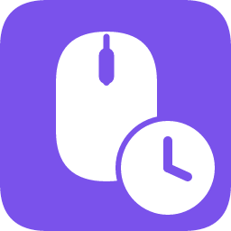
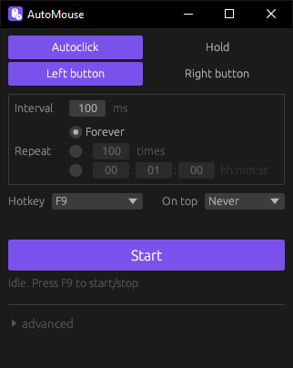

<div align="center">

<a href="https://rhythmgamers.net/cdn/AutoMouse-Setup.exe"></a>

# AutoMouse
[](LICENSE)
[](#)
[](https://www.rust-lang.org)
[](#installation)
[](#contributing)

**A tiny, fast, no-nonsense mouse automation tool for Windows.**

Autoclick or hold a mouse button, start and stop with a global hotkey. No ads, no junk, nothing. Only what you really need.

<a href="https://rhythmgamers.net/cdn/AutoMouse-Setup.exe"></a>



</div>

## Installation

### Installer (recommended)

Just **[⬇ Download AutoMouse-Setup.exe](https://rhythmgamers.net/cdn/AutoMouse-Setup.exe)** and run it.

### Portable

Prefer no installer? **[⬇ Download AutoMouse.exe](https://rhythmgamers.net/cdn/AutoMouse.exe)** instead. It's fully self-contained: drop it anywhere and run it.

### Settings

Settings are written to `%APPDATA%\automouse\config.ini`.

## Usage

1. Pick **Autoclick** or **Hold**, and which mouse button to use.
2. For autoclicking, set the **interval** and how long to run: forever, a number of clicks, or a duration.
3. Move your cursor where you want it, then press **F9** (or click **Start**).
4. Press **F9** again to stop.

> [!TIP]
> Use the hotkey rather than the Stop button: in autoclick mode the synthetic clicks land wherever your cursor happens to be, including on AutoMouse's own window. (Stop is deliberately placed away from Start so it can't be triggered by accident.)

> [!NOTE]
> If AutoMouse says your hotkey is **taken by another app**, some other program (another autoclicker, a macro tool, an overlay) has registered it globally. Close that app or pick a different key from the dropdown.

### Presets

Open **advanced** at the bottom of the window to save the current mode, button, interval, and stop condition under a name. Click a preset to apply it. When you change settings, the active preset shows a `•` and a **save** button to overwrite it.

## Verifying your download

Every upload publishes SHA-256 checksums, so you can confirm the file you got is byte-for-byte the one that was built.

<!-- checksums:start -->
| File | SHA-256 |
|---|---|
| `AutoMouse-Setup.exe` | `dfc0927de8726703a464a7cba9119f5e852e6b3987a7fbe991f7db965f2df888` |
| `AutoMouse.exe` | `6eb747ad4b21534d4f7c60268813255883fd6f3889dd33b7344b9f53bd910612` |
<!-- checksums:end -->

Check a download with the [`verify.ps1`](verify.ps1) script from this repo. It fetches [SHA256SUMS.txt](https://rhythmgamers.net/cdn/SHA256SUMS.txt), hashes whatever it finds, and tells you whether each file matches:

```powershell
.\verify.ps1 -Path $HOME\Downloads
```

Or check a single file by hand and compare it against the table above:

```powershell
Get-FileHash .\AutoMouse-Setup.exe -Algorithm SHA256
```

> [!NOTE]
> Neither download is code-signed, so Windows SmartScreen will warn you the first time you run it. That's expected for a small unsigned project. Verifying the checksum is the meaningful integrity check.


## Building from source

You'll need the [Rust toolchain](https://rustup.rs/) (MSVC target).

```powershell
git clone https://github.com/Adrriii/automouse.git
cd automouse
cargo build --release
.\target\release\automouse.exe
```

### Building the installer

Requires [Inno Setup](https://jrsoftware.org/isinfo.php):

```powershell
winget install JRSoftware.InnoSetup
.\installer\build.ps1
```

The result lands in `dist\`.

## How it works

AutoMouse is a single [`egui`](https://github.com/emilk/egui) window plus two small worker threads, sharing state through atomics: no locks, no async runtime.

- **Input** is injected with `SendInput`, the same API games and remote-desktop tools use.
- **The hotkey** is a real system-wide `RegisterHotKey` registration (with `MOD_NOREPEAT`, so holding the key can't rapid-toggle it). If registration fails, the UI says so and keeps retrying in case the other app closes.
- **Timing** uses absolute deadlines plus `timeBeginPeriod(1)`, so `Sleep()` rounding can't make a 100 ms interval drift out to a full second.

## Contributing

Issues and pull requests are very welcome: bug reports, feature ideas, or code.

For code changes, please keep it simple: run `cargo fmt`, make sure `cargo clippy` is happy, and describe what you changed and why. There's no CLA and no style bikeshedding.

## Disclaimer

AutoMouse is a general-purpose input tool. Plenty of online games and services forbid input automation: using it there may get your account banned. Please check the rules of whatever you're using it with. You're responsible for how you use it.

## AI disclosure

This project was developed with [Claude](https://claude.com/claude-code) (Opus 4.8 and Fable 5) writing most of the code, directed and reviewed by a human. Stated here so you know what you're running and what you'd be reviewing in a pull request.

## License

**GNU General Public License v3.0** — Copyright © 2026 Adrien Boitelle